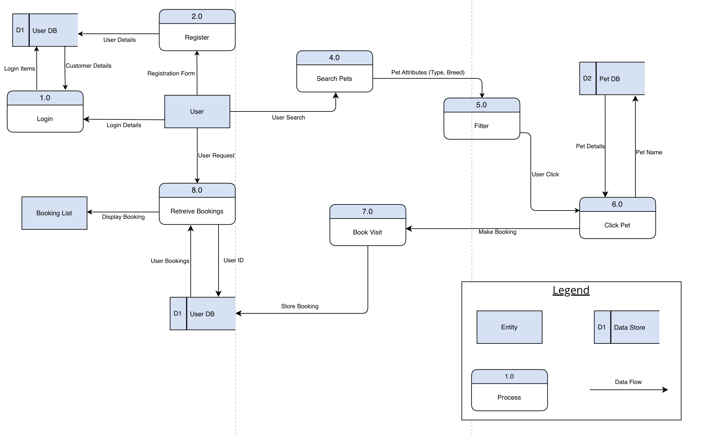

# **Pet Adoption Service_T3A2** <!-- omit in toc -->
## **Table of Contents:** <!-- omit in toc -->
- [**R1 - Description of your website**](#r1---description-of-your-website)
- [**R2 - Dataflow Diagram**](#r2---dataflow-diagram)
- [**R3 - Application Architecture Diagram**](#r3---application-architecture-diagram)
- [**R4 - User Stories**](#r4---user-stories)
- [**R5 - Wireframes for multiple standard screen sizes, created using industry standard software**](#r5---wireframes-for-multiple-standard-screen-sizes-created-using-industry-standard-software)
- [**R6 - Screenshots of your Trello board throughout the duration of the project**](#r6---screenshots-of-your-trello-board-throughout-the-duration-of-the-project)

---

## **R1 - Description of your website**
A platform for individuals and families to browse and adopt animals from cats, dogs and other animals in need of a new home. Users can search based on breed, gender, size, age and many more. The website will contain photos, information about each animal and application processes to adopt a new animal.
Further information can be found either through the FAQ page or after booking a visit to see our friendly staff for assistance with our furry friends. We aim to provide the best possible information once you have submitted a ticket.

---
## **R2 - Dataflow Diagram**
This is our data flow diagram using the Gane Sarson methodology.

---
## **R3 - Application Architecture Diagram**

---
## **R4 - User Stories**

---
## **R5 - Wireframes for multiple standard screen sizes, created using industry standard software**

Wireframes were created using Balsamiq:

---
## **R6 - Screenshots of your Trello board throughout the duration of the project**

Our Trello board is available [Here](https://trello.com/b/XB2z1h7g
)!

![]{}

---
